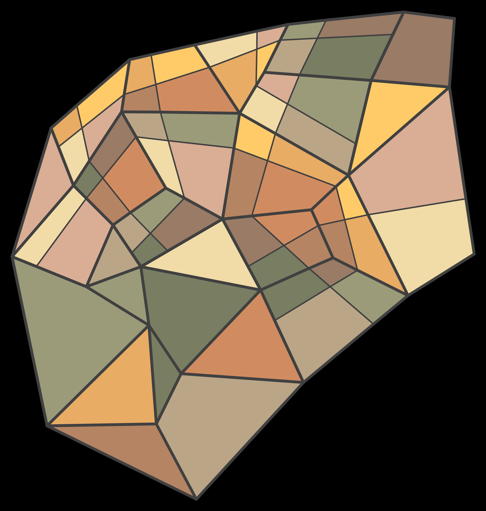

# About

I've been playing a lot of [Transport Fever 2](https://store.steampowered.com/app/1066780/Transport_Fever_2/) recently,
and I've noticed procedural city layouts in video games usually follow a grid pattern, similar to many US cities.
However, Europans cities are a bit more chaotic. So I've been thinking about how a European city layout could be
generated.

I'm not sure how far I'll take this; it's just a little bit of fun. I might render the city in 3D
with [jMonkeyEngine](https://github.com/jMonkeyEngine/jmonkeyengine) later, and maybe turn this into a little game.

It's still very much a work in progress, so I won't spend too much time on documentation at the moment.

# How To

It's a Gradle-based Kotlin project. The easiest way could be to
run [GenerateLayout.kt](src/main/kotlin/simulation/GenerateLayout.kt) in IntelliJ.
